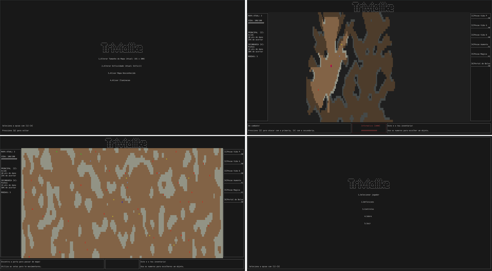

# Trivial-Like LI2

## About the Project

This project was developed for the LI2 University of Minho Subject of the Software Engineering degree.

On this project were left tons of hours of work, and we are proud of the final result. Each new feature that we added, we won more energy to continue and to improve the project.

#### Grade ⭐️ 19/20

### Demo 📽️



https://github.com/Darguima/Trivial-Like-LI2/assets/49988070/bd3e1cbd-0621-4597-a22c-3aba0e414fc2

### Features

* Players name (to continue the game after leaving it)
* Random map generation with dynamic size
* Vision system (that can be turned off), with lightning system
* Random enemies generation, with IA movement
* Random items generation
* Settings (that are persistent even after closing the game)
* Music

### Controls ⌨️ (Keyboard Only)

* **Arrows** - Move the player
* **q** - Enter Pause mode

###### The game controls are shown on the bottom of the screen, and shown when is possible to use them.

## Download 📥📲

You can download the game on [project's releases](https://github.com/Darguima/Trivial-Like-LI2/releases).

### The goal ⛳️

As you can easily see on the demo, the goal was develop a clone of Roguelike game with ncurses library from C.

If you want, you can read the [project statement](enunciado.pdf) (in Portuguese).

### About the Code 🧑‍💻

We try to since the begin organize the code in a way that we could easily add new features, creating a very well modulated project, always splitting the events from the drawing functions.

## Getting Started 🚀

#### Cloning the repository

```bash
$ git clone https://github.com/Darguima/Trivial-Like-LI2.git
$ git clone git@github.com:Darguima/Trivial-Like-LI2.git
```

### Installing dependencies 📦

```bash
# Debian / Ubuntu / Mint
$ sudo apt-get install libncurses-dev build-essential libjson-c-dev

# Arch
$ sudo pacman -S sdl2_mixer
```

#### Running the project 🏃‍♂️

Start by going to the root folder:

```bash
$ cd Trivial-Like-LI2/
```

##### Compiling the code 🛠️
```bash
$ make

# Executing program
$ ./triviallike
```

##### Developing

This function `clean`, `compile` and `execute` the project

```bash
$ make dev
```

##### Cleaning object files and executable
```bash
$ make clean
```

## Developed by 🧑‍💻:

- [Afonso Pedreira](https://github.com/afooonso)
- [Dário Guimarães](https://github.com/darguima)
- [Hugo Rauber](https://github.com/HugoLRauber)
- [Rodrigo Macedo](https://github.com/rmufasa)
